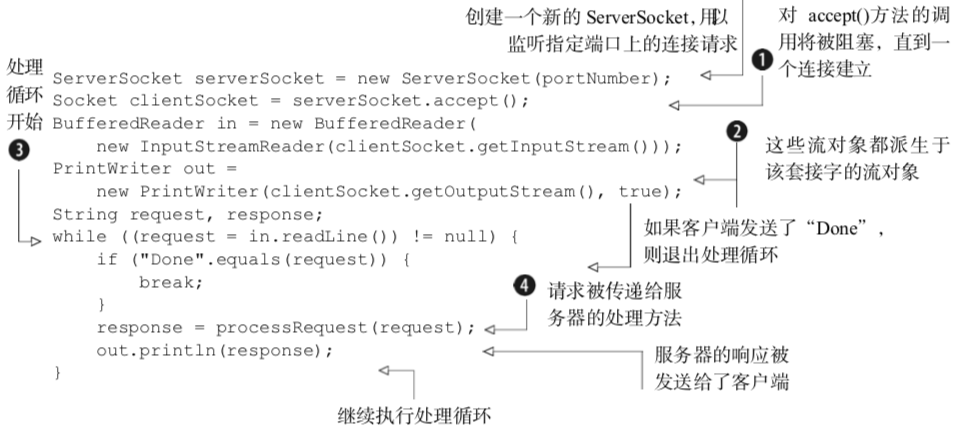
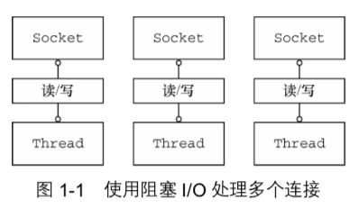
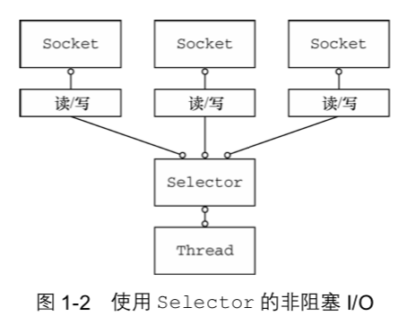

#  netty 学习笔记

本次学习内容 主要是通过阅读 Netty 实战（Netty in Action） 获取

Netty是一款异步的事件驱动的网络应用程序框架，支持快速地开发可维护的高性能的面向协议的服务器和客户端

# 1. Netty的概念及体系结构

## 1.1 Java网络编程

早期的Java API 只支持由本地系统套接字库提供的所谓的阻塞函数。如下展示了一个使用了这些函数调用的服务器代码的普通示例：

其中实现类Socket API的基本模式之一，以下有几个最重要的点
- ServerSocket 上的 accept()方法将会一直阻塞到一个连接建立（①），随后返回一个新的Socket用于客户端和服务器之间的通信。该ServerSocket将继续监听传入的连接
- BufferedReader 和 PrintWriter 都衍生自Socket的输入输出流（②）。前者从一个字符输入流中读取文本，后者打印对象的格式化的表示到文本输出流。
- readLine() 方法将会阻塞，直到在③处一个由换行符或者回车符结尾的字符串被读取。
- 客户端的请求已经被处理（④）

这一段代码只能同时处理一个连接, 要管理多个并发客户端，需要为每个新客户端Socket创建一个新的线程，如下

这个方案的影响：
- 任何时候都可能有大量的线程处于休眠状态，只是等待输入或者输出数据就绪，这可能算是一种资源浪费。
- 需要为每个线程的调用栈都分配内存，其默认值大小区间为64KB到1MB，具体取决于操作系统。
- 即使Java虚拟机（JVM）在物理上可以支持非常大数量的线程，但是远在到达该极限之前，上下文切换所带来的开销就会带来麻烦，例如，在达到10000个连接的时候。

虽然这种并发方案对于支撑中小数量的客户端来说还算可以接受，但是为了支撑 100000 或 者更多的并发连接所需要的资源使得它很不理想。幸运的是，还有一种方案。

### 1.1.1 Java NIO

除了上面的代码底层的阻塞系统调用之外，本地套接字库很早就提供了非阻塞调用，其为网络资源的利用率提供了相当多的控制。

- 可以使用 setsockopt()方法配置套接字，以便读/写调用在没有数据的时候立即返回， 也就是说，如果是一个阻塞调用应该已经被阻塞了
- 可以使用操作系统的事件通知API（IO多路复用）注册一组非阻塞套接字，以确定它们中是否有任何的 套接字已经有数据可供读写

Java 对于非阻塞 I/O 的支持是在 2002 年引入的，位于 JDK 1.4 的 java.nio 包中。

NIO 最开始是新的输入/输出(New Input/Output)的英文缩写，但是，该 Java API 已经出现足够长的时间 了，不再是“新的”了，因此，如今大多数的用户认为 NIO 代表非阻塞 I/O(Non-blocking I/O)，而阻塞 I/O(blocking I/O)是旧的输入/输出(old input/output，OIO)。你也可能遇到它被称为普通 I/O(plain I/O)的时候。

### 1.1.2 选择器

图 1-2 展示了一个非阻塞设计，其实际上消除了上一节中所描述的那些弊端。
`class java.nio.channels.Selector` 是 Java 的非阻塞 I/O 实现的关键。它使用了事件通知 API 以确定在一组非阻塞套接字中有哪些已经就绪能够进 行 I/O 相关的操作。因为可以在任何的时间检查任意 的读操作或者写操作的完成状态，所以如图 1-2 所示， 一个单一的线程便可以处理多个并发的连接。
总体来看，与阻塞 I/O 模型相比，这种模型提供 了更好的资源管理:
使用 Selector 的非阻塞 I/O
- 使用较少的线程便可以处理许多连接，因此也减少了内存管理和上下文切换所带来开销; 
- 当没有 I/O 操作需要处理的时候，线程也可以被用于其他任务。
 
 尽管已经有许多直接使用 Java NIO API 的应用程序被构建了，但是要做到如此正确和安全并
不容易。特别是，在高负载下可靠和高效地处理和调度 I/O 操作是一项繁琐而且容易出错的任务， 最好留给高性能的网络编程专家——Netty。